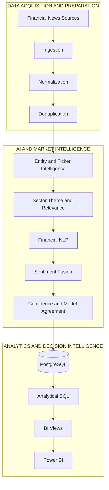
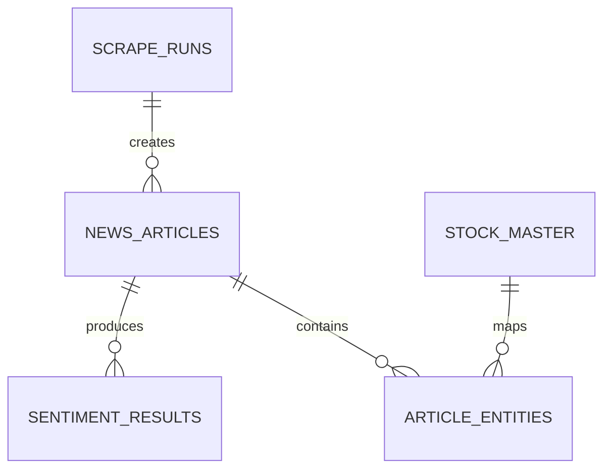
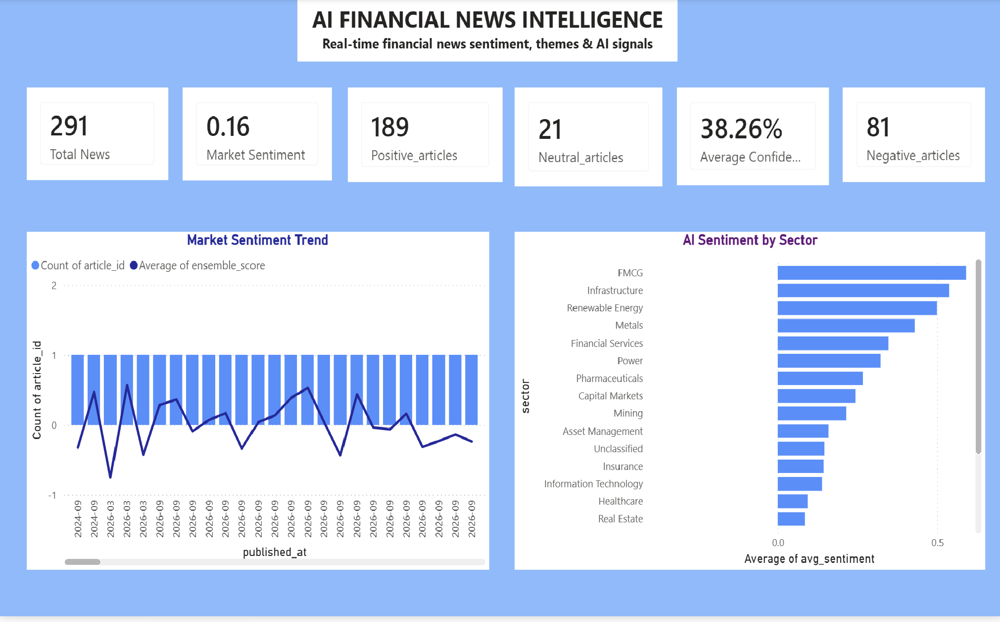
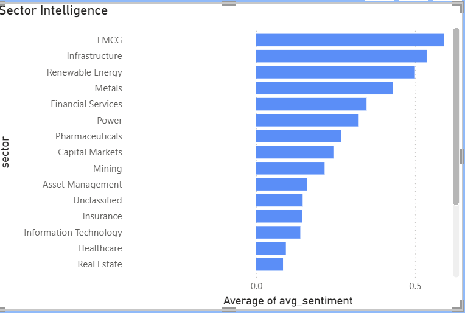
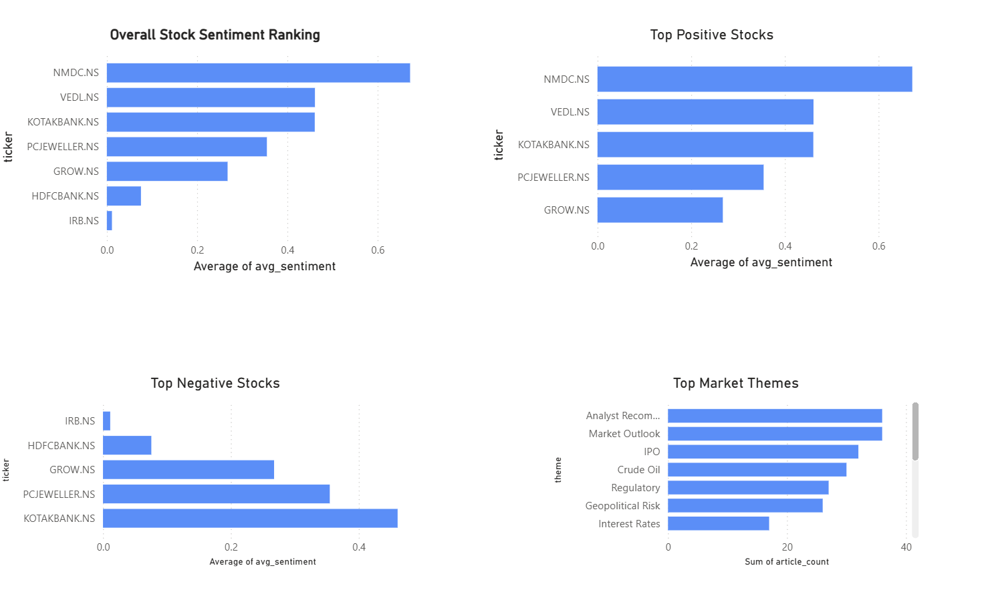
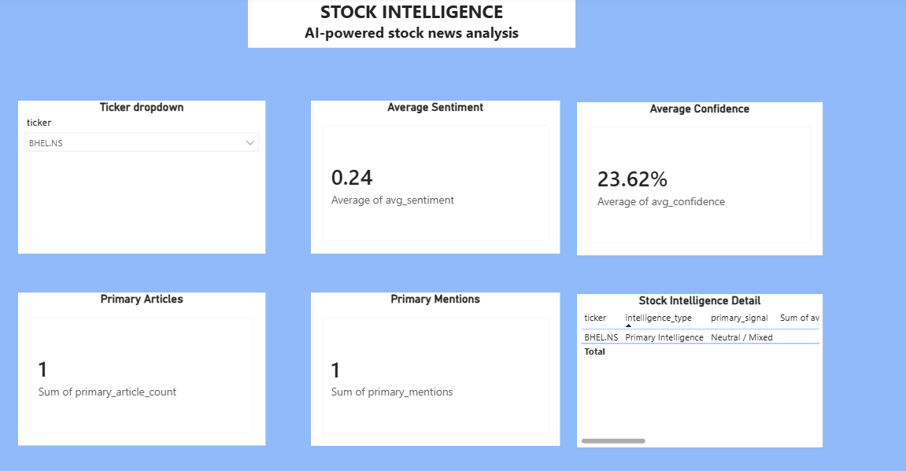

<div align="center">

# 📈 AI Stock Sentiment Analytics

### **From Financial News → AI Intelligence → Decision-Ready Analytics**

<p>
  
  
  
  
  
  
  
</p>

**Documentation-first financial analytics platform for transforming unstructured market news into structured, explainable and interactive intelligence.**

[📖 Documentation](#-documentation-hub) ·
[🏗️ Architecture](#%EF%B8%8F-system-architecture) ·
[🧠 AI/ML](#-ai--ml-methodology) ·
[📊 Power BI](#-power-bi-decision-intelligence) ·
[💡 Business Insights](#-business-insights)

</div>

---

## 📌 Executive Summary


> **Turning unstructured financial news into structured, explainable market intelligence.**

| 🔴 BUSINESS CHALLENGE | 🟣 AI-DRIVEN SOLUTION | 🟢 BUSINESS OUTCOME |
|---|---|---|
| Financial news is fragmented, repetitive and difficult to compare across companies, sectors and themes. | An end-to-end pipeline combines entity intelligence, sector/theme classification, VADER + FinBERT sentiment, confidence and model agreement. | Analysts can move from **market → sector → stock → article** and trace insights back to the underlying evidence. |

### 🚀 What makes this project different

**Not just a sentiment model.**

This project connects:

`DATA ENGINEERING` → `FINANCIAL NLP` → `MACHINE LEARNING` → `SQL ANALYTICS` → `POWER BI` → `DECISION INTELLIGENCE`

### 📊 At a Glance

| Dimension | Capability |
|---|---|
| **Domain** | Financial Markets / Indian Equities |
| **NLP** | VADER + FinBERT |
| **Data Platform** | PostgreSQL |
| **Analytics** | SQL / CTEs / Aggregations / Window Functions |
| **BI** | Power BI |
| **Entity Intelligence** | Stock / Company / Index / Commodity |
| **Classification** | Sector + Market Themes + Relevance |
| **Uncertainty** | Confidence + Model Agreement |
### 🔎 At a Glance

| Dimension | Project Capability |
|---|---|
| **Domain** | Financial Markets / Indian Equities |
| **Primary use case** | Financial-news intelligence & decision support |
| **NLP** | VADER + FinBERT |
| **Data platform** | PostgreSQL |
| **Analytics** | SQL / CTEs / aggregations / window functions |
| **BI** | Power BI |
| **Entity intelligence** | Stock / company / index / commodity / entity type |
| **Classification** | Sector + market themes + relevance |
| **Uncertainty** | Confidence + model agreement/disagreement |
| **Portfolio scope** | Documentation-first public repository |
| **Trading execution** | Out of scope |
| **Direct stock-price prediction** | Out of scope |

> **Important:** This project is designed for **analytics and decision support**, not automated trading or guaranteed stock-price forecasting.

---

# 🧭 Table of Contents

<details>
<summary><b>Open navigation</b></summary>

- [Executive Summary](#-executive-summary)
- [Business Problem](#-business-problem)
- [What This Project Demonstrates](#-what-this-project-demonstrates)
- [System Architecture](#%EF%B8%8F-system-architecture)
- [End-to-End Data Flow](#-end-to-end-data-flow)
- [Data Acquisition](#-data-acquisition)
- [Entity & Sector Intelligence](#-entity--sector-intelligence)
- [AI / ML Methodology](#-ai--ml-methodology)
- [Data Model](#-data-model)
- [Analytics Layer](#-analytics-layer)
- [Power BI Decision Intelligence](#-power-bi-decision-intelligence)
- [Business Insights](#-business-insights)
- [Data Quality](#-data-quality)
- [Data Science Manager Lens](#-data-science-manager-lens)
- [Engineering Decisions](#-engineering-decisions)
- [Validation](#-validation)
- [Public Repository](#-public-repository)
- [Documentation Hub](#-documentation-hub)
- [Limitations](#%EF%B8%8F-limitations)
- [Portfolio Positioning](#-portfolio-positioning)

</details>

---

# 🎯 Business Problem

Financial-news analytics looks simple until the data is examined closely.

### The practical challenges

- News arrives from multiple sources and formats.
- The same story can appear multiple times.
- Company names can be ambiguous.
- A company mention does not automatically establish a sector.
- Headlines may contain market context without company-specific relevance.
- Sentiment models can disagree.
- A single sentiment label can hide uncertainty.
- Aggregate dashboard metrics need traceability back to article-level evidence.

### The analytical response

```text
UNSTRUCTURED NEWS
        ↓
STANDARDIZE
        ↓
REMOVE DUPLICATES
        ↓
IDENTIFY ENTITIES
        ↓
CLASSIFY SECTOR / THEME / RELEVANCE
        ↓
APPLY FINANCIAL NLP
        ↓
FUSE MODEL SIGNALS
        ↓
PRESERVE CONFIDENCE + AGREEMENT
        ↓
STORE IN POSTGRESQL
        ↓
ANALYZE WITH SQL
        ↓
VISUALIZE IN POWER BI
        ↓
DECISION SUPPORT
```

---

# 📊 What This Project Demonstrates

| Capability | Evidence in the Project |
|---|---|
| 🧲 Multi-source ingestion | Web / RSS / API-oriented collection strategies |
| 🧹 Data engineering | Normalization and deduplication |
| 🏷️ Entity intelligence | Company, ticker, index, commodity and entity types |
| 🧭 Classification | Sector, theme and relevance |
| 🧠 Financial NLP | VADER + FinBERT |
| ⚖️ Model fusion | 0.35 × VADER + 0.65 × FinBERT |
| 🎯 Uncertainty | Confidence + agreement/disagreement |
| 🗄️ Data platform | PostgreSQL |
| 📐 Analytics engineering | CTEs, aggregations, window functions and BI views |
| 📊 BI | Power BI decision-intelligence dashboards |
| 🧪 Validation | Automated/regression testing |
| 🏛️ Architecture | Separation of ingestion, processing, persistence, analytics and presentation |

---

# 🏗️ End-to-End Data & AI Architecture

The platform follows a layered architecture that separates data acquisition, AI-driven market intelligence, and downstream analytics and decision intelligence.




### Architecture layers

| Layer | Responsibility | Design Principle |
|---|---|---|
| **Ingestion** | Source-specific collection | Isolate source behavior |
| **Processing** | Normalize + deduplicate | Consistent analytical records |
| **Entity Intelligence** | Map entities/tickers | Avoid uncontrolled propagation |
| **Context Intelligence** | Sector/theme/relevance | Add business meaning |
| **Financial NLP** | VADER + FinBERT | Complementary signals |
| **Persistence** | PostgreSQL | Durable analytical storage |
| **Analytics** | SQL | Reusable metrics and BI views |
| **Presentation** | Power BI | Decision-oriented consumption |

➡️ **Deep dive:** [System Architecture](docs/System_Architecture.md)

---

# 🔄 End-to-End Data Flow

### 01 — Ingest

Collect financial-news records through source-specific acquisition strategies.

### 02 — Normalize

Create a common article representation and standardize fields.

### 03 — Deduplicate

Reduce repeated stories using URL/headline-oriented logic.

### 04 — Enrich

Add:

- ticker / entity information
- entity type
- sector
- theme
- relevance / quality context

### 05 — Score

Apply VADER and FinBERT and preserve component-level outputs.

### 06 — Persist

Store enriched records and operational metadata in PostgreSQL.

### 07 — Analyze

Build reusable analytical SQL and BI-oriented views.

### 08 — Visualize

Expose market, sector, stock and ticker intelligence through Power BI.

➡️ **Deep dive:** [Data Pipeline](docs/Data_Pipeline.md)

---

# 📰 Data Acquisition

The ingestion layer intentionally uses source-specific strategies rather than treating every publisher as identical.

| Source / Channel | Acquisition Approach |
|---|---|
| **Moneycontrol** | Requests / HTML, JSON-LD and source-specific extraction |
| **Economic Times** | Requests + BeautifulSoup + JSON-LD / HTML fallbacks |
| **Investing.com** | Browser-impersonated requests + BeautifulSoup / JSON-LD |
| **Trendlyne** | Playwright / browser rendering + BeautifulSoup |
| **LiveMint** | Requests + BeautifulSoup |
| **Reuters discovery** | Google News RSS + Reuters filtering |
| **Reddit** | JSON-based endpoint where applicable |
| **NSE reference data** | NSE reference / ticker data |
| **Twitter/X** | Mock / source placeholder in current implementation |

<details>
<summary><b>Why source-specific collectors?</b></summary>

Financial websites differ in HTML structure, rendering behavior, metadata availability and access patterns.

Isolating source-specific logic makes individual collectors easier to maintain without forcing the entire ingestion layer to change.

</details>

---

# 🏷️ Entity & Sector Intelligence

## Entity intelligence

Supported entity categories include:

```text
LISTED_STOCK
SUBSIDIARY
PRIVATE_COMPANY
IPO_CANDIDATE
INDEX
COMMODITY
UNKNOWN
```

## Sector classification is intentionally independent

```text
Ticker Mapping
      ≠
Sector Classification
```

A weak ticker match should not automatically determine the sector.

When evidence is insufficient:

```text
Sector = Unclassified
```

That is treated as a **data-quality safeguard**, not a failure.

---

# 🧠 AI / ML Methodology

## Financial NLP stack

```text
                 ARTICLE TEXT
                     │
          ┌──────────┴──────────┐
          │                     │
       VADER                 FinBERT
          │                     │
          └──────────┬──────────┘
                     ↓
             WEIGHTED FUSION
                     ↓
          CONFIDENCE + AGREEMENT
                     ↓
             FINAL SENTIMENT
```

### Model roles

| Component | Purpose |
|---|---|
| **VADER** | Lightweight lexicon/rule-based sentiment |
| **FinBERT** | Finance-domain transformer sentiment |
| **Fusion** | Weighted combination |
| **Confidence** | Model certainty signal |
| **Agreement** | Model consistency signal |

### Current documented fusion

```text
Ensemble Score
      =
0.35 × VADER
      +
0.65 × FinBERT
```

> This is a **weighted fusion strategy**, not a separately trained ensemble model.

### Why model agreement matters

These two outputs are not analytically equivalent:

```text
Positive
+ High Confidence
+ Strong Agreement
```

versus:

```text
Positive
+ Lower Confidence
+ Model Disagreement
```

Preserving both cases makes uncertainty visible to downstream analytics.

➡️ **Deep dive:** [AI/ML Methodology](docs/AI_ML_Methodology.md)

---

# 🗄️ Data Model

The analytical persistence layer is centered on PostgreSQL.

### Core domains

| Domain | Purpose |
|---|---|
| `news_articles` | Normalized articles and article-level intelligence |
| `sentiment_results` | VADER, FinBERT, ensemble, confidence and agreement |
| `stock_master` | Market entity / reference data |
| `article_entities` | Article-to-entity relationships |
| `scrape_runs` | Operational pipeline metadata |

### Conceptual relationship



➡️ **Deep dive:** [Data Model](docs/Data_Model.md)

---

# 📐 Analytics Layer

The SQL layer converts persisted records into reusable analytical outputs.

### Analytical techniques

- CTEs
- aggregations
- window functions
- sector analysis
- model disagreement analysis
- stock intelligence
- BI-oriented reporting views

### Analytical grain

```text
Market
   ↓
Sector
   ↓
Stock / Ticker
   ↓
Article
   ↓
Model Output
```

This allows the dashboard to move from **high-level signal → underlying evidence**.

➡️ [Analytics Methodology](docs/Analytics_Methodology.md)

---

# 📈 Power BI Decision Intelligence

The dashboard is designed around a decision journey rather than a collection of disconnected charts.

## 01 · AI Market Intelligence

**Executive view**

- market sentiment
- article activity
- sector sentiment
- stock rankings
- market themes

## 02 · Stock Sentiment & Themes

**Comparative view**

- overall stock sentiment
- top positive stocks
- top negative stocks
- market themes
- sector intelligence

## 03 · Ticker Deep Dive

**Diagnostic view**

- ticker filter
- average sentiment
- confidence
- article / mention counts
- stock intelligence detail

> The dashboard is a portfolio analytics artifact and **not a live trading terminal**.

### Dashboard evidence

<div align="center">

### Executive Market Intelligence



### Sector Intelligence



### Stock Sentiment & Themes



### Ticker Deep Dive



</div>

➡️ **Dashboard documentation:** [Dashboard Guide](docs/Dashboard_Guide.md)

---

# 💡 Business Insights

The platform is designed to support questions across four analytical levels.

<details>
<summary><b>🌐 Market Intelligence</b></summary>

- What is the distribution of positive, neutral and negative news?
- Which sectors have the strongest sentiment?
- Which themes are generating the most coverage?

</details>

<details>
<summary><b>🏢 Stock Intelligence</b></summary>

- Which stocks have the strongest news sentiment?
- Which stocks are receiving unusually high news attention?
- Does sentiment agree with model confidence?

</details>

<details>
<summary><b>🧠 Model Intelligence</b></summary>

- Where do VADER and FinBERT disagree?
- Which articles have lower-confidence sentiment?
- How does model agreement change interpretation?

</details>

<details>
<summary><b>📊 BI Traceability</b></summary>

- Can aggregate insights be traced back to article-level evidence?
- Can an analyst explore results interactively by ticker or sector?

</details>

➡️ **Business interpretation:** [Business Insights](docs/Business_Insights.md)

---

# 👩‍💼 Data Science Manager Lens

This section intentionally highlights **leadership-level analytical thinking**, not only implementation.

| Managerial Dimension | Demonstrated Through |
|---|---|
| **Architecture** | End-to-end separation of ingestion, NLP, storage, analytics and BI |
| **Data Quality** | Conservative sector/entity classification |
| **Model Governance** | Confidence + agreement/disagreement |
| **Explainability** | Retention of component model outputs |
| **Product Thinking** | Dashboard organized around decision journeys |
| **Analytics Strategy** | Market → sector → stock → article analytical grain |
| **Engineering Trade-offs** | Source-specific collectors and modular layers |
| **Business Translation** | Turning model outputs into decision-oriented metrics |
| **Governance** | Public/private separation and controlled disclosure |

---

# 🧩 Engineering Decisions

| Decision | Why |
|---|---|
| Separate ticker mapping from sector classification | Prevents uncertain entity matches from contaminating sector intelligence |
| Preserve `Unclassified` | Avoids false precision |
| Retain VADER + FinBERT outputs | Enables model-level comparison |
| Track confidence + disagreement | Makes uncertainty visible |
| Normalize before analytics | Improves consistency |
| Deduplicate before aggregation | Prevents repeated stories from inflating metrics |
| PostgreSQL → SQL → Power BI | Separates storage, analytics and presentation |
| Source-specific collectors | Handles differences across acquisition channels |
| Documentation-first public repository | Demonstrates architecture without exposing private implementation |

---

# 🧪 Validation

A documented regression run included:

```text
2 passed
```

Validation also covered pipeline execution, scraper behavior and reporting-oriented outputs during development.

<details>
<summary><b>Validation philosophy</b></summary>

The project treats validation as more than a model metric. Data ingestion, processing behavior, persistence and reporting outputs are all part of the analytical product.

</details>

---

# 🔐 Public vs Private

### Public portfolio

- architecture
- data pipeline documentation
- AI/ML methodology
- analytics methodology
- data model
- Power BI evidence
- business insights
- engineering decisions
- sample / synthetic data
- interview guide

### Keep private

- credentials
- API keys / tokens
- `.env`
- private raw datasets
- private database dumps
- proprietary implementation source
- private configuration
- local environments

➡️ [Deployment Guide](docs/Deployment_Guide.md)

---

# 📁 Public Repository Structure

```text
AI-Stock-Sentiment-Analytics/
│
├── README.md
│
├── docs/
│   ├── AI_ML_Methodology.md
│   ├── Analytics_Methodology.md
│   ├── Business_Insights.md
│   ├── Dashboard_Guide.md
│   ├── Data_Model.md
│   ├── Data_Pipeline.md
│   ├── Data_Quality.md
│   ├── Deployment_Guide.md
│   ├── Interview_Guide.md
│   ├── Project_Overview.md
│   ├── System_Architecture.md
│   └── README.md
│
├── architecture/
├── screenshots/
│   └── powerbi/
│       ├── executive_overview.png
│       ├── sector_intelligence.png
│       ├── stock_sentiment_themes.png
│       └── ticker_deep_dive.png
│
└── sample_data/
```

---

# ⚠️ Limitations

- Financial-news coverage is not the complete information set of a market.
- Source HTML / RSS / API behavior can change.
- Some sources provide limited article text.
- Entity names can be ambiguous.
- Sector classification can remain uncertain.
- Sentiment quality depends on the text available to the models.
- Sentiment should not be interpreted as a guaranteed stock-price forecast.
- The project does not execute trades.

---

# 📚 Documentation Hub

| Category | Resource |
|---|---|
| 🎯 **Project** | [Project Overview](docs/Project_Overview.md) |
| 🏗️ **Architecture** | [System Architecture](docs/System_Architecture.md) |
| 🔄 **Data Engineering** | [Data Pipeline](docs/Data_Pipeline.md) |
| 🧠 **AI / ML** | [AI/ML Methodology](docs/AI_ML_Methodology.md) |
| 📐 **Analytics** | [Analytics Methodology](docs/Analytics_Methodology.md) |
| 🗄️ **Data Model** | [Data Model](docs/Data_Model.md) |
| ✅ **Data Quality** | [Data Quality](docs/Data_Quality.md) |
| 📊 **BI** | [Dashboard Guide](docs/Dashboard_Guide.md) |
| 💡 **Business** | [Business Insights](docs/Business_Insights.md) |
| 🚀 **Deployment** | [Deployment Guide](docs/Deployment_Guide.md) |
| 🎯 **Interview** | [Interview Guide](docs/Interview_Guide.md) |

---

# 📚 References

The project methodology and technology choices are informed by the following primary references:

| Reference | Purpose |
|---|---|
| **FinBERT — Financial Sentiment Analysis with Pre-trained Language Models** | Finance-domain transformer model used for financial NLP sentiment analysis |
| **VADER — Valence Aware Dictionary and sEntiment Reasoner** | Lexicon/rule-based sentiment component used alongside FinBERT |
| **PostgreSQL Documentation** | Relational database and analytical persistence layer |
| **Microsoft Power BI Documentation** | Business intelligence and interactive dashboard layer |
| **Hugging Face Transformers Documentation** | Transformer model implementation and inference ecosystem |

### Primary resources

- FinBERT: https://arxiv.org/abs/1908.10063
- VADER: https://github.com/cjhutto/vaderSentiment
- PostgreSQL: https://www.postgresql.org/docs/
- Microsoft Power BI: https://learn.microsoft.com/power-bi/
- Hugging Face Transformers: https://huggingface.co/docs/transformers/

---

# 🏁 Portfolio Positioning

This project demonstrates the ability to connect:

**Data Engineering + Data Science + Financial NLP + Machine Learning + SQL + Business Intelligence + Software Engineering**

The central story is:

> ### **Not just a sentiment model.**
>
> **An end-to-end analytics product that converts unstructured financial information into structured, explainable and decision-ready intelligence.**

---

<div align="center">

## 📈 AI Stock Sentiment Analytics

**Unstructured Data → Engineered Intelligence → Analytical Insight → Business Decision**

</div>
